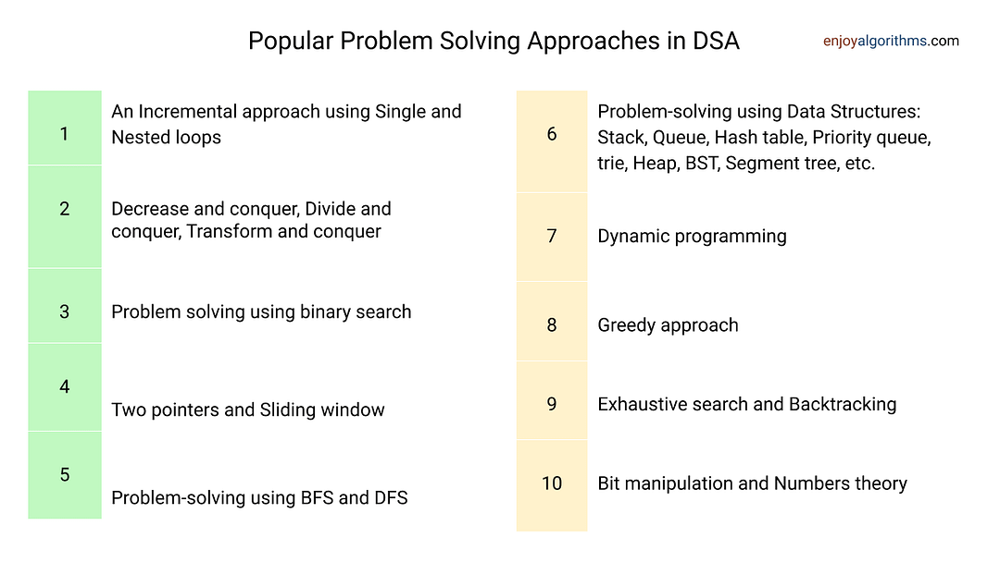
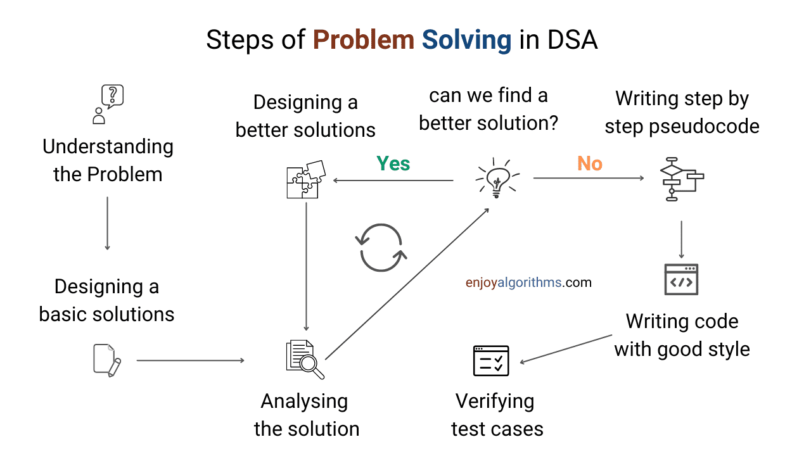
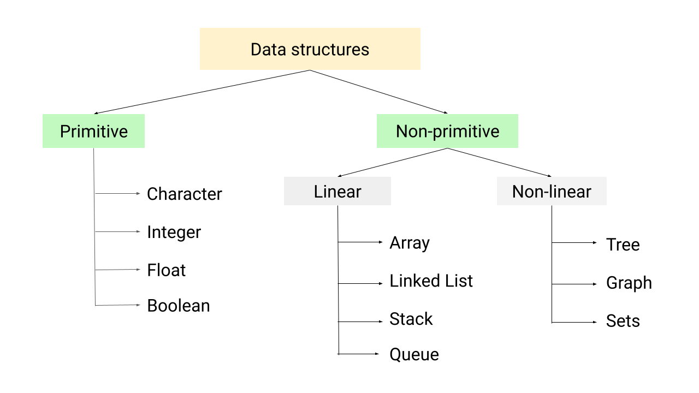
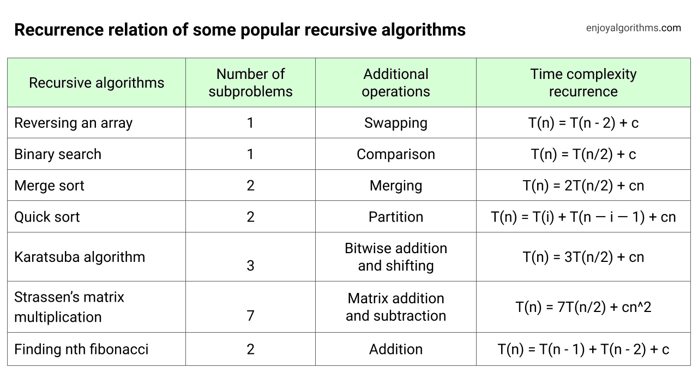
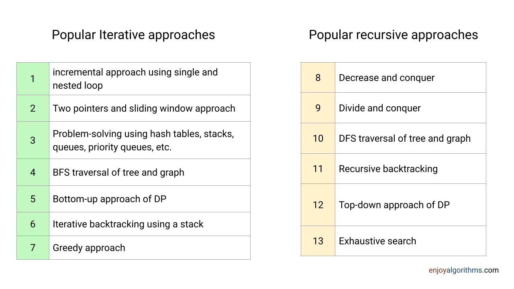

## Problem-Solving Approaches in Data Structures and Algorithms

## Steps of Problem Solving in DSA

### Critical ideas to remember
Always ask the following questions related to input for every coding problem:
- What is the size of input? like 10 0r 1000 or 10billion!
- What is the **data type** of input? It can be an integer, floating-point number, character, string or boolean.
- How input values are stored? It can be stored in a data structure like an array, linked list, tree, graph, etc.
- Is there some information available for the distribution of input? Like values can be stored in sorted order, input is allowed in a certain range, some permutation of the input is allowed only, etc.

## Type and classification of data structures

## Recurrence relation of some popular recursive algorithms

## Difference between Recursion and Iteration in DSA
### In terms of thought process
- Recursion is often more natural for algorithmms such as binary search, merge sort, quick sort, DFS traversal of a graph, etc. Similarly, approaches like backtracking and data structures like trees are often easier to understand using recursion.

- On the other hand, many coding problems are more straightforward to solve using iteration. Recursive solutions may be challenging or impossible to understand in these cases. For example, insertion sort, heap sort and BFS traversal of a graph or tree are often more efficiently implemented using iteration.

